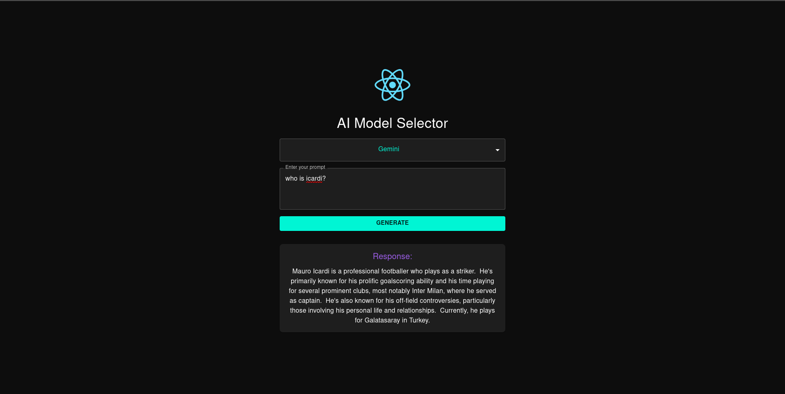

# LLM-Models-Comparison

This project integrates multiple AI models using FastAPI and HuggingFace for generating text-based responses. The backend includes routes for interacting with models such as Gemini, Mistral, LLaMA, GPT-NeoX-20B, and GPT-2. The frontend allows users to select a model, input a prompt, and get a generated response.



## Features

- **Multiple AI Models**: Choose between Gemini, Mistral, LLaMA, GPT-NeoX-20B, and GPT-2 for text generation.
- **Frontend Interface**: Simple UI for entering prompts and displaying responses.
- **FastAPI Backend**: Efficient backend to handle API calls and model interaction.

## Tech Stack

- **Backend**: FastAPI, HuggingFace (for GPT-NeoX, Mistral, LLaMA, GPT-2)
- **Frontend**: React, MUI (Material UI), Axios
- **Environment Variables**: `.env` for storing API keys (e.g., HuggingFace, OpenAI).

## Setup Instructions

### Prerequisites

1. Python 3.12.4
2. Node.js 20.11.0
3. Install dependencies using the following:

    - Backend:
      ```bash
      pip install -r backend/requirements.txt
      ```

    - Frontend:
      ```bash
      cd frontend
      npm install
      ```

### Backend Setup

1. Clone the repository.
2. Create a `.env` file in the backend directory and add your API keys:
    - `HUGGINGFACE_API_KEY` for HuggingFace models (e.g., GPT-NeoX, Mistral, LLaMA, GPT-2).
3. Run the FastAPI backend server:
    ```bash
    uvicorn backend.main:app --reload
    ```

### Frontend Setup

1. Ensure the backend server is running.
2. Start the React frontend:
    ```bash
    npm start
    ```

### Available Models

- **Gemini**: A generative model for creative text generation.
- **Mistral**: A 7B instruction-following model.
- **LLaMA**: Facebook’s LLaMA model.
- **GPT-NeoX-20B**: EleutherAI's GPT-NeoX model for large-scale text generation.
- **GPT-2**: A smaller GPT model for quick text generation.

### API Routes

- `/gemini/`: Generate content using Gemini.
- `/mistral/`: Generate content using Mistral.
- `/llama/`: Generate content using LLaMA.
- `/gpt-neox/`: Generate content using GPT-NeoX-20B.
- `/gpt2/`: Generate content using GPT-2.

### Example Usage

1. Open the frontend application (`http://localhost:3000`).
2. Select a model (e.g., GPT-NeoX) from the dropdown.
3. Enter a prompt and click "Generate".
4. The generated response will appear below.
